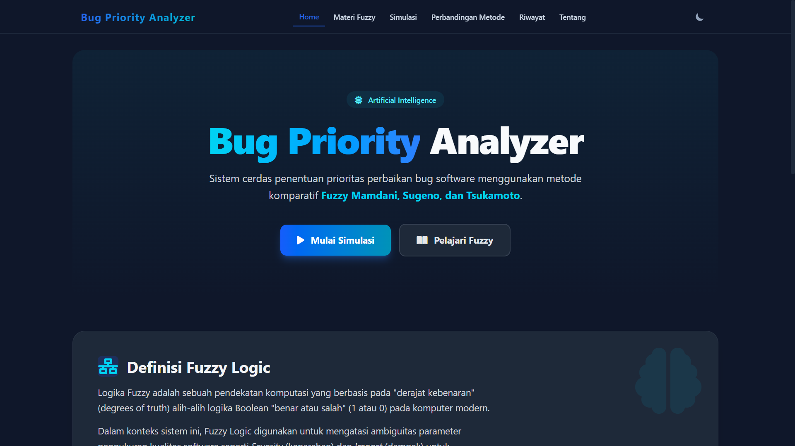
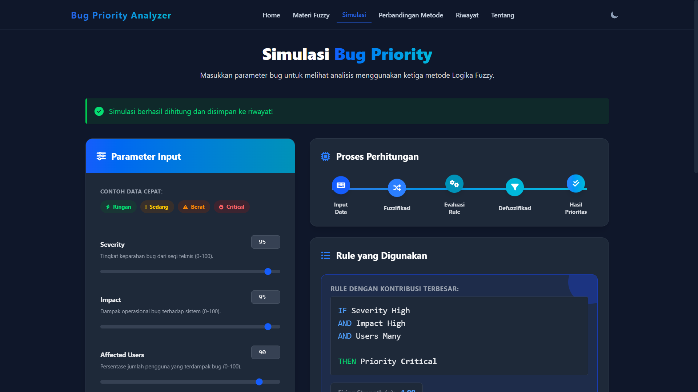
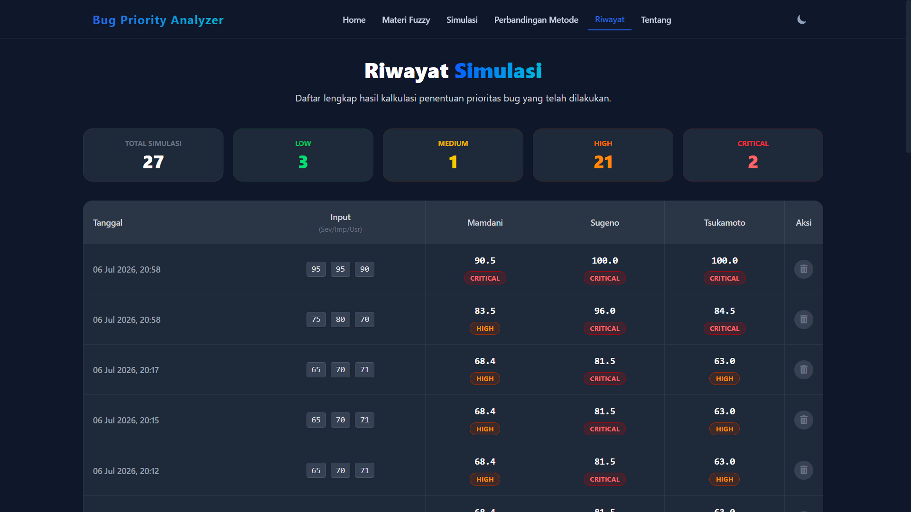

# Bug Priority Analyzer 🚀

Sistem pakar penentuan prioritas bug software berbasis kecerdasan buatan (AI) yang menggunakan sistem inferensi Logika Fuzzy (Mamdani, Sugeno, dan Tsukamoto). Proyek ini memfasilitasi tim *Software Engineering / Quality Assurance* untuk mengklasifikasikan tingkat kedaruratan suatu perbaikan sistem *(bug fix)* secara konsisten dan objektif.

## 📌 Deskripsi Singkat

Sistem ini mengambil tiga pilar penilaian (dalam skala kepastian 0 hingga 100):
1. **Severity:** Keparahan teknikal kerusakan dari sisi *development*.
2. **Impact:** Dampak kerugian operasional dan bisnis bagi ekosistem aplikasi.
3. **Affected Users:** Perkiraan persentase jumlah pelanggan/pengguna riil yang menjadi korban kerusakan.

Berlandaskan parameter linguistik Fuzzy tersebut, mesin memformulasikan probabilitas untuk kemudian mengeluarkan **Label Prioritas**:
- `Low` (Dapat ditunda)
- `Medium` (Perlu dijadwalkan)
- `High` (Segera ditangani)
- `Critical` (Bloker rilis - Wajib diperbaiki saat itu juga)

## 🛠️ Teknologi yang Digunakan

| Komponen | Teknologi | Keterangan |
| :--- | :--- | :--- |
| **Backend Framework** | Laravel 13 | Menangani request POST simulasi dan integrasi komputasi *Service Layer* Fuzzy. |
| **Frontend Styling** | Tailwind CSS V4 | Membangun UI berbasis *Utility-First* yang mendukung *Dark/Light mode* instan. |
| **Templating Engine** | Blade | Menyajikan halaman dinamis terintegrasi (*Layouting & UI Components*). |
| **Interaksi DOM** | Vanilla JavaScript | Menangani interaksi UI murni seperti *sync* Slider dengan input *Number*. |
| **Database** | SQLite / MySQL | Mengelola dan merekam histori pengetesan ke dalam tabel `bugs`. |

## 📚 Metode Fuzzy Logic yang Diadopsi

Proyek ini menjadi jembatan edukasi dengan menandingkan langsung tiga algoritma pengolah kerancuan:

1. **Metode Mamdani (Max-Min / Centroid):** Algoritma tertua (1975) yang outputnya berupa sekumpulan kurva fuzzy. Hasil mutlak diperoleh dari pencarian titik berat gabungan ruang. Sangat manusiawi namun rumit secara komputasional.
2. **Metode Sugeno (Takagi-Sugeno-Kang):** Mengganti area himpunan luaran menjadi nilai konstan numerik (atau persamaan orde-satu linier). Sangat cepat saat diprogram dan dieksekusi mesin karena defuzzifikasinya hanya berbasis Nilai Rata-rata Berbobot (*Weighted Average*).
3. **Metode Tsukamoto:** Menggunakan logika linear monoton untuk merepresentasikan bagian *consequent* dari aturan (IF-THEN). Memiliki transisi nilai yang amat mulus tanpa perhitungan integral kompeks.

## 📂 Struktur Utama Direktori

Pemisahan logika adalah inti dari keamanan desain sistem ini. Sistem AI diletakkan **terpisah total** dari blok HTTP Controller.

```text
📦 Bug Priority Analyzer
 ┣ 📂 app
 ┃ ┣ 📂 Http
 ┃ ┃ ┗ 📂 Controllers
 ┃ ┃   ┣ 📜 HomeController.php
 ┃ ┃   ┣ 📜 SimulasiController.php      # Orkestrator Form & Database
 ┃ ┃   ┣ 📜 PerbandinganController.php
 ┃ ┃   ┗ 📜 HistoryController.php
 ┃ ┣ 📂 Models
 ┃ ┃ ┗ 📜 Bug.php                       # Model ORM untuk tabel riwayat
 ┃ ┗ 📂 Services                        # 🔥 CORE AI ENGINE
 ┃   ┣ 📜 FuzzyRuleService.php          # Logika Evaluasi dan Fuzzifikasi Independen
 ┃   ┣ 📜 FuzzyMamdaniService.php       # Logika Defuzzifikasi Mamdani
 ┃   ┣ 📜 FuzzySugenoService.php        # Logika Defuzzifikasi Sugeno
 ┃   ┗ 📜 FuzzyTsukamotoService.php     # Logika Defuzzifikasi Tsukamoto
 ┣ 📂 database
 ┃ ┗ 📂 migrations
 ┃   ┗ 📜 xxxx_create_bugs_table.php    # Skema RDBMS
 ┣ 📂 docs                              # Dokumentasi Proyek & Laporan
 ┃   ┣ 📜 Setup_Guide.md
 ┃   ┣ 📜 User_Manual.md
 ┃   ┣ 📜 Fuzzy_Logic_Explanation.md
 ┃   ┗ 📜 Laporan_UAS_AI.md
 ┣ 📂 resources
 ┃ ┣ 📂 css
 ┃ ┃ ┗ 📜 app.css                       # Konfigurasi Tailwind v4
 ┃ ┗ 📂 views
 ┃   ┣ 📂 layouts                       # Master Template
 ┃   ┣ 📜 home.blade.php
 ┃   ┣ 📜 materi.blade.php
 ┃   ┣ 📜 simulasi.blade.php
 ┃   ┣ 📜 perbandingan.blade.php
 ┃   ┣ 📜 history.blade.php
 ┃   ┗ 📜 tentang.blade.php
 ┣ 📂 routes
 ┃ ┗ 📜 web.php                         # Definisi Endpoint Routing
 ┗ 📂 tests
   ┗ 📂 Feature
     ┗ 📜 WebRoutingTest.php            # Automated Integration Tests
```

## 📸 Antarmuka Sistem (UI)

*Sistem ini mendukung transisi halus warna **Hitam, Biru, dan Cyan** bergaya modern Dashboard.*

### Halaman Home



*Menampilkan hero section dan alur sistem.*

### Halaman Simulasi



*Menampilkan slider reaktif & Card Komparasi berwarna dinamis.*

### Halaman Riwayat



*Menampilkan tabel statistik rekam jejak prioritas.*

## 🚀 Panduan Instalasi dan Menjalankan Proyek

Pastikan di perangkat Anda telah terinstall **PHP >= 8.2** dan **Composer**.

1. **Clone repositori proyek ini**
   ```bash
   git clone <url-repo>
   cd "Project UAS"
   ```

2. **Install dependensi framework**
   ```bash
   composer install
   npm install
   ```

3. **Konfigurasi Lingkungan (Environment)**
   Duplikat file konfigurasi dan tetapkan APP_KEY.
   ```bash
   copy .env.example .env
   php artisan key:generate
   ```
   Pastikan di `.env` tertulis koneksi database yang Anda inginkan, misal:
   ```env
   DB_CONNECTION=sqlite
   # (Jika MySQL sesuaikan DB_DATABASE, DB_USERNAME, dll)
   ```

4. **Siapkan Struktur Database**
   Lakukan migrasi tabel `bugs`.
   ```bash
   php artisan migrate
   ```

5. **Bangun Aset Frontend (Tailwind)**
   Buka terminal *baru*, dan jalankan compiler Vite:
   ```bash
   npm run dev
   ```

6. **Jalankan Backend Server Laravel**
   Buka terminal lain, dan jalankan server pengembangan:
   ```bash
   php artisan serve
   ```
   Akses `http://127.0.0.1:8000` di web browser Anda! Selamat melakukan eksplorasi logika Fuzzy.

---
🎓 *Dikembangkan untuk pemenuhan tugas Mata Kuliah Kecerdasan Buatan (AI) - Program Studi TRPL.*
